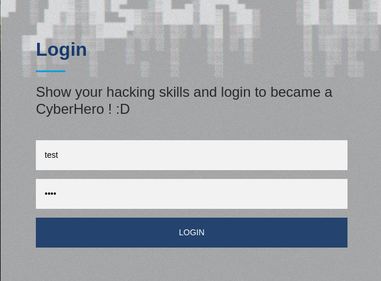
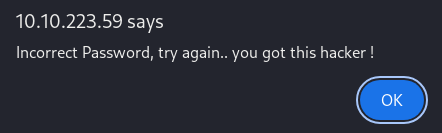
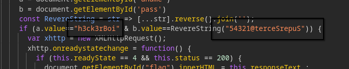

`CyberHeroes` is a super easy THM ctf where you have to bypass client-side authentication and uncover hardcoded credentials to capture the flag in this web challenge.

# Introduction

**Name:** CyberHeroes  
**Challenge type:** Web challenge  
**Rated difficulty:** Easy  
**Objective:** Bypass the login form to get the flag

# Nmap Scan Results

```
PORT   STATE SERVICE VERSION
80/tcp open  http    Apache httpd 2.4.48 ((Ubuntu))
|_http-title: CyberHeros : Index
|_http-server-header: Apache/2.4.48 (Ubuntu)
```

# Enumerating HTTP

let's intercept this request in caido, so that we can test stuff e.g SQLi, username enumeration etc etc

   

but instead we get this an unexpected response..

   

after this, i knew the website was authenticating us client side which is a terrible idea.

after opening dev tools and going to login.html we get some hardcoded credentials

   

```
h3ck3rBoi:54321@terceSrepuS
```

but the password string is reversed, let's fix that

```
$ '54321@terceSrepuS' | rev
XXXXXXXXXXX
```

i'm not showing the real password haha

after that you can login to the web app and get the flag!!
